# Guía de Sitios Turísticos - AppTurismo

## Descripción

**AppTurismo** es una aplicación móvil Android desarrollada en Kotlin con Jetpack Compose, cuyo propósito es ayudar a los usuarios a explorar sitios turísticos, consultar información de diferentes destinos y encontrar lugares cercanos mediante la ubicación del dispositivo.

La aplicación permite buscar y filtrar destinos, consultar información detallada, visualizar imágenes, guardar sitios favoritos y utilizar la ubicación del usuario para localizar destinos próximos.

# APIs utilizadas

## ArcGIS

Se utiliza la API de ArcGIS para consultar atractivos turísticos y obtener información de destinos cercanos utilizando la ubicación del dispositivo.

## Wikimedia Commons

Se utiliza la API de Wikimedia Commons para obtener imágenes relacionadas con los destinos turísticos.

## Retrofit

La comunicación con las APIs externas se realiza mediante Retrofit.

## Propósito

La meta de AppTurismo es proporcionar una herramienta móvil sencilla y funcional para descubrir destinos turísticos y acceder a información relevante sobre cada sitio.

El proyecto fue desarrollado como parte del proyecto final de la asignatura de **Aplicaciones Móviles**.

---

## Características principales

* Visualización de sitios turísticos.
* Búsqueda de destinos.
* Filtrado de lugares por categorías.
* Visualización de información detallada de cada destino.
* Visualización de calificaciones y opiniones.
* Obtención de la ubicación del usuario mediante GPS.
* Localización de destinos próximos.
* Registro de sitios favoritos.
* Consulta de favoritos almacenados localmente.
* Exhibición de fotografías de los destinos.
* Consulta de información mediante servicios en línea.
* Almacenamiento local de datos mediante Room.
* Almacenamiento de preferencias mediante DataStore.
* Navegación entre diferentes pantallas mediante Jetpack Compose.

---

## Tecnologías utilizadas

* **Kotlin**
* **Jetpack Compose**
* **Android Studio**
* **MVVM**
* **Repository Pattern**
* **Room Database**
* **DataStore**
* **StateFlow**
* **Flow**
* **Coroutines**
* **Retrofit**
* **OkHttp**
* **Coil**
* **Google Play Services Location**
* **Android Navigation Compose**

---

# Arquitectura

La aplicación utiliza el patrón arquitectónico **MVVM (Model-View-ViewModel)** junto con el patrón **Repository**.

Esta organización permite separar la interfaz de usuario, la lógica de presentación y las fuentes de datos.

La comunicación general de la aplicación se organiza de la siguiente manera:

```text
UI / Jetpack Compose
        │
        ▼
    ViewModel
        │
        ▼
    Repository
    ┌────┴────┐
    ▼         ▼
  Room     Retrofit
    │         │
    ▼         ▼
  Datos     API REST
  local     remota

DataStore
    ▲
    │
Preferencias del usuario
```

## Capas principales

### UI

Contiene las pantallas y componentes visuales desarrollados con Jetpack Compose.

Entre las principales pantallas se encuentran:

* HomeScreen
* DestinosScreen
* DetalleDestinoScreen
* FavoritosScreen
* AjustesScreen
* UbicacionScreen

También contiene los componentes reutilizables y la configuración de navegación.

### ViewModel

Los ViewModel administran el estado de la interfaz y coordinan las operaciones realizadas por la aplicación.

Utilizan StateFlow, Flow y Coroutines para proporcionar información reactiva a las pantallas.

Algunos ViewModel utilizados son:

* DestinoViewModel
* FavoritoViewModel
* PreferenciasViewModel
* UbicacionViewModel

### Repository

La capa Repository funciona como intermediaria entre los ViewModel y las fuentes de datos.

Los ViewModel no acceden directamente a los DAO de Room ni a Retrofit. Las operaciones de datos se realizan mediante los repositorios correspondientes.

Entre ellos se encuentran:

* DestinoRepository
* FavoritoRepository
* DestinoRemoteRepository

### Room

Room Database se utiliza para almacenar información local de forma estructurada.

En AppTurismo se utiliza principalmente para gestionar los destinos favoritos del usuario.

Entre sus componentes se encuentran:

* Entidades.
* DAO.
* Base de datos.
* DatabaseProvider.
* FavoritoRepository.

### DataStore

DataStore se utiliza para almacenar preferencias de usuario de manera persistente.

La aplicación utiliza esta tecnología para conservar configuraciones y preferencias aunque la aplicación se cierre.

### Retrofit

Retrofit permite realizar solicitudes a servicios web mediante una API REST.

Los datos obtenidos desde servicios externos son procesados por la capa de datos y posteriormente entregados a la interfaz mediante los ViewModel.

### Coil

Coil se utiliza para cargar y mostrar imágenes provenientes de Internet dentro de la aplicación.

---

# API y servicios externos

AppTurismo utiliza servicios externos para obtener información relacionada con los sitios turísticos y las imágenes.

## Retrofit

Retrofit se utiliza como cliente HTTP para realizar las solicitudes a servicios REST.

La comunicación remota se encuentra organizada dentro de la capa:

```text
data/remote
```

Entre sus componentes se encuentran:

* ApiService
* ApiTest.kt
* ApiTestViewModel
* DestinoApi
* DestinoApiResponse.kt
* DestinoRemoteRepository
* ImagenApiClient
* ImagenApiService.kt
* RetrofitClient

## OkHttp

OkHttp se utiliza junto con Retrofit para gestionar las solicitudes HTTP.

También permite configurar aspectos de las peticiones realizadas a los servicios externos.

## Estados de las operaciones

Las operaciones que dependen de servicios externos contemplan los estados habituales de una operación asíncrona:

* **Cargando:** mientras se realiza la solicitud.
* **Éxito:** cuando los datos son obtenidos correctamente.
* **Error:** cuando ocurre un problema durante la consulta o no existe conexión disponible.

---

# GPS y ubicación

La aplicación utiliza la ubicación del dispositivo para identificar la posición actual del usuario y facilitar la búsqueda de destinos turísticos cercanos.

Para esta funcionalidad se utiliza:

**Google Play Services Location**

La aplicación obtiene las coordenadas de ubicación y las utiliza para realizar la búsqueda de destinos próximos.

La gestión de esta funcionalidad se encuentra principalmente en:

* `UbicacionViewModel`

y en las pantallas relacionadas con la ubicación.

La aplicación contempla el caso en que el usuario no permita el acceso a la ubicación.

---

# Permisos

La aplicación utiliza permisos relacionados con las siguientes funcionalidades:

* Acceso a Internet.
* Ubicación aproximada.
* Ubicación precisa.

Estos permisos permiten que la aplicación pueda consultar servicios externos y utilizar la ubicación del dispositivo para encontrar destinos cercanos.

La ubicación requiere autorización del usuario durante la ejecución de la aplicación.

---

# Persistencia local

## Room Database

Room se utiliza para administrar la información almacenada localmente.

En AppTurismo permite guardar los sitios favoritos del usuario.

La estructura incluye:

* Favorito
* FavoritoDao
* FavoritoDatabase
* DatabaseProvider
* FavoritoRepository

## DataStore

DataStore se utiliza para almacenar las preferencias de la aplicación.

La implementación se encuentra dentro de:

```text
data/database/datastore
```

y utiliza componentes como:

* PreferenciasDataStore.kt
* PreferenciasViewModel
* PreferenciasViewModelFactory

---

# Navegación

La navegación de la aplicación se implementa utilizando **Navigation Compose**.

La aplicación cuenta con diferentes pantallas que permiten al usuario desplazarse entre:

```text
Inicio
  │
  ├── Destinos
  │     │
  │     └── Detalle del destino
  │
  ├── Favoritos
  │
  ├── Ubicación
  │
  └── Ajustes
```

La configuración principal de la navegación se encuentra en:

`Navigation.kt`

---

# Estructura del proyecto

```text
com.example.appturismo
│
├── data
│   └── database
│       │
│       ├── datastore
│       │   └── preferences
│       │       └── PreferenciasDataStore.kt
│       │
│       ├── model
│       │   └── Destino
│       │
│       ├── remote
│       │   ├── ApiService.kt
│       │   ├── ApiTestViewModel
│       │   ├── DestinoApi
│       │   ├── DestinoApiResponse.kt
│       │   ├── DestinoRemoteRepository
│       │   ├── ImagenApiClient
│       │   ├── ImagenApiService.kt
│       │   └── RetrofitClient
│       │
│       ├── repository
│       │   ├── DestinoRepository
│       │   └── FavoritoRepository
│       │
│       ├── DatabaseProvider
│       ├── Favorito
│       ├── FavoritoDao
│       └── FavoritoDatabase
│
├── ui
│   └── theme
│       │
│       ├── components
│       │   └── DestinoCard.kt
│       │
│       │
│       ├── screens
│       │   ├── AjustesScreen.kt
│       │   ├── DestinosScreen.kt
│       │   ├── DetalleDestinoScreen.kt
│       │   ├── FavoritosScreen.kt
│       │   ├── HomeScreen.kt
│       │   └── UbicacionScreen.kt
│       │
│       ├── Color.kt
│       ├── Navigation.kt
│       ├── Theme.kt
│       └── Type.kt
│
├── viewmodel
│   ├── DestinoViewModel.kt
│   ├── FavoritoViewModel
│   ├── FavoritoViewModelFactory
│   ├── ImagenTestViewModel
│   ├── PreferenciasViewModel
│   ├── PreferenciasViewModelFactory
│   └── UbicacionViewModel
│
├── AppTurismoApp
└── MainActivity
```

---

# Organización del proyecto

## Datos

La capa de datos contiene los elementos relacionados con la gestión y acceso a la información de la aplicación.

## Modelo

Contiene los modelos de datos utilizados por la aplicación.

El modelo principal utilizado para los destinos turísticos es:

* Destino

## Almacenamiento

La aplicación cuenta con dos mecanismos principales de almacenamiento:

* **Room:** para datos estructurados y favoritos.
* **DataStore:** para preferencias del usuario.

## Repositorios

Los repositorios permiten separar la lógica de acceso a datos de la lógica de presentación.

Esto permite que los ViewModel trabajen con una única capa de acceso a los datos.

## Remoto

Contiene los componentes utilizados para acceder a servicios externos mediante Retrofit y OkHttp.

---

# Interfaz de usuario

La interfaz fue desarrollada utilizando **Jetpack Compose**.

La estructura de UI contiene:

```text
components/
    Elementos reutilizables.

screens/
    Pantallas de la aplicación.

di/
    Configuración de dependencias.

Navigation.kt
    Gestión de la navegación.

Color.kt
    Configuración de colores.

Theme.kt
    Configuración del tema.

Type.kt
    Configuración de estilos de texto.
```

---

# ViewModel

La carpeta `viewmodel` contiene los ViewModel responsables de administrar el estado de la interfaz y coordinar las operaciones entre la UI y la capa de datos.

---

# Pantallas de la aplicación

La aplicación cuenta con diferentes pantallas navegables.

## Inicio

Permite acceder a las principales funcionalidades de AppTurismo.

## Destinos

Muestra una lista dinámica de sitios turísticos y permite realizar búsquedas y filtros.

## Detalle del destino

Muestra información específica sobre el destino seleccionado.

## Favoritos

Permite consultar los sitios turísticos guardados por el usuario.

## Ubicación

Permite utilizar la ubicación del dispositivo para encontrar destinos próximos.

## Ajustes

Permite gestionar las preferencias disponibles en la aplicación.

---

# Diagrama de arquitectura

La aplicación AppTurismo utiliza una arquitectura basada en MVVM y el patrón Repository, separando la interfaz de usuario, la lógica de presentación y las fuentes de datos.

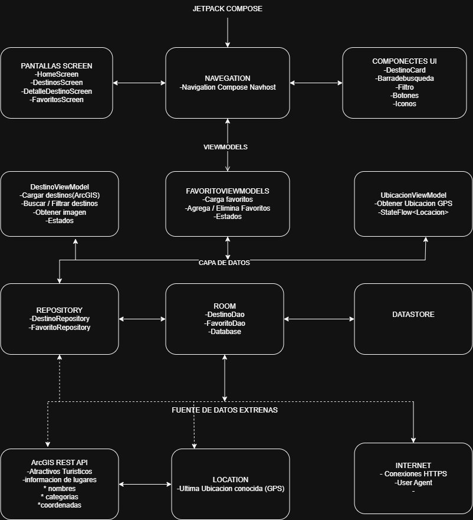

---

# Capturas de pantalla

## Pantalla principal

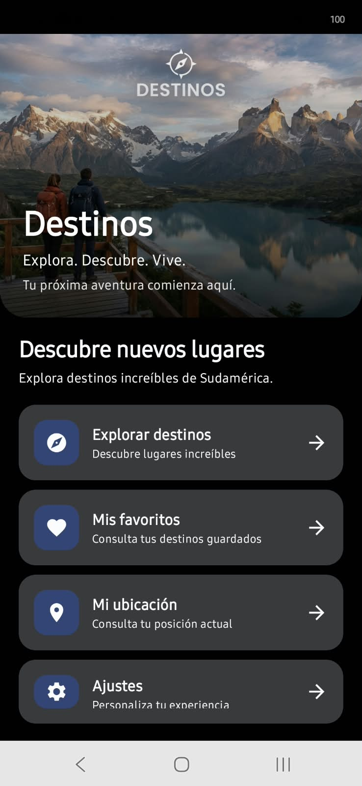

## Lista de destinos

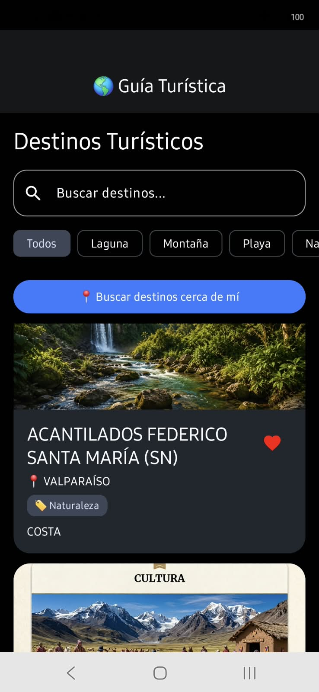

## Detalle del destino

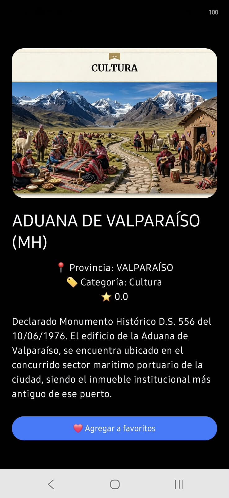

## Favoritos

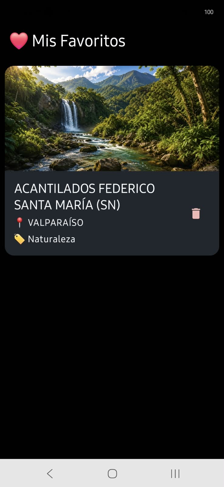

## Ubicación

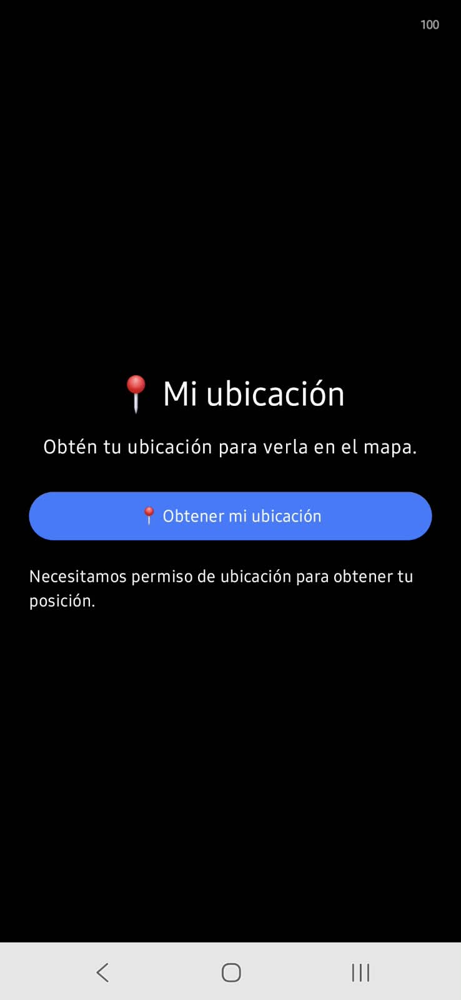

## Confirmación de ubicación


## Muestra de ubicación

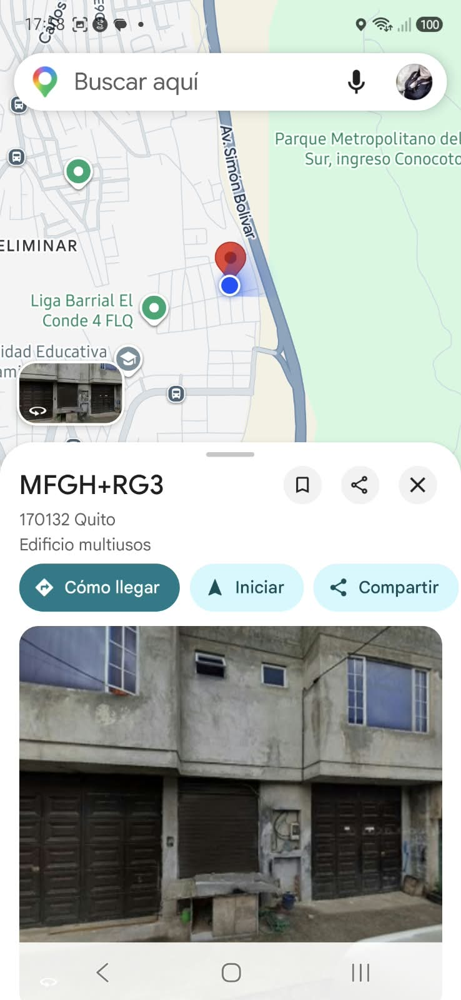

## Ajustes

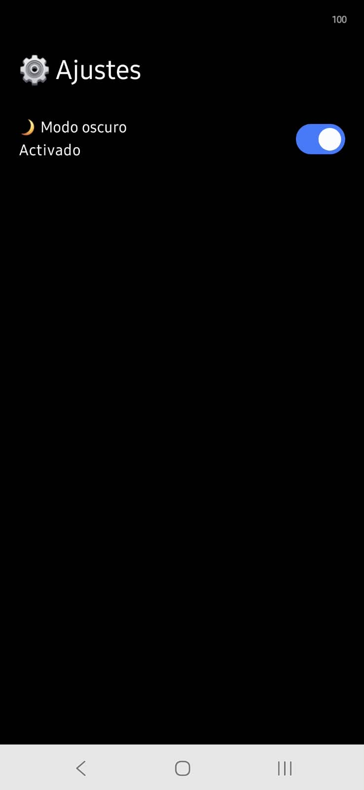

---

# Capturas de filtros

## Filtro 1

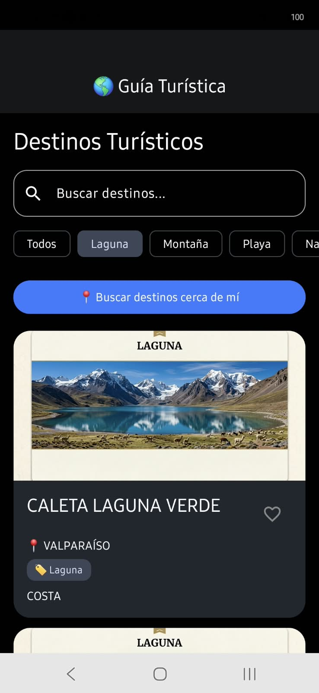

## Filtro 2

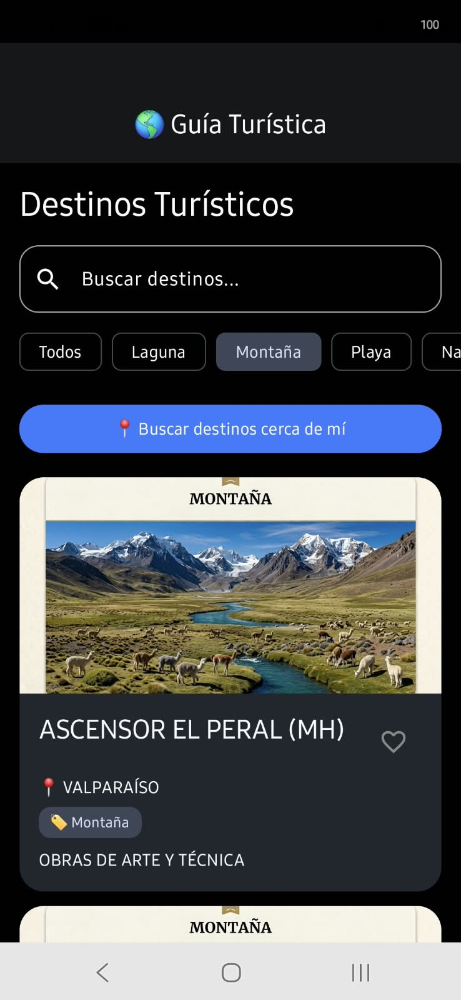

## Filtro 3

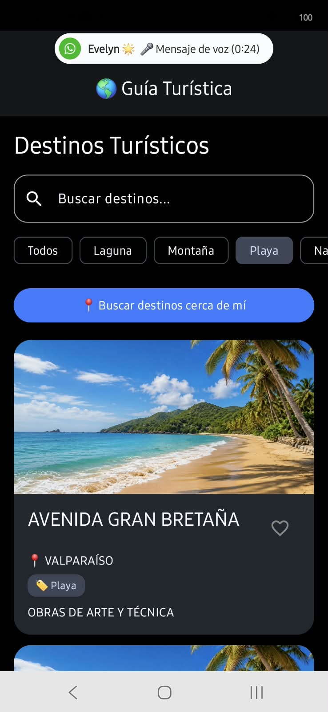

## Filtro 4

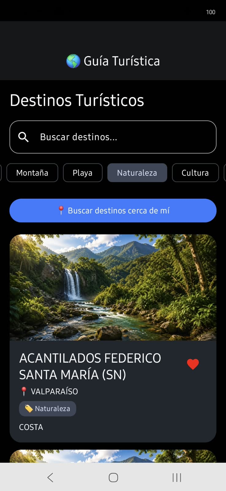

## Filtro 5

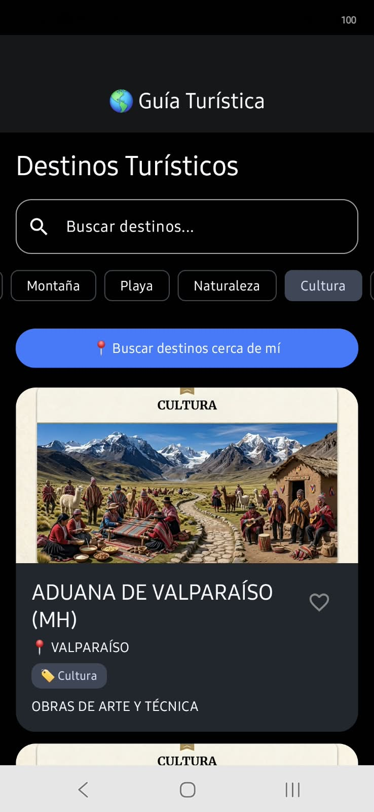

## Filtro 6

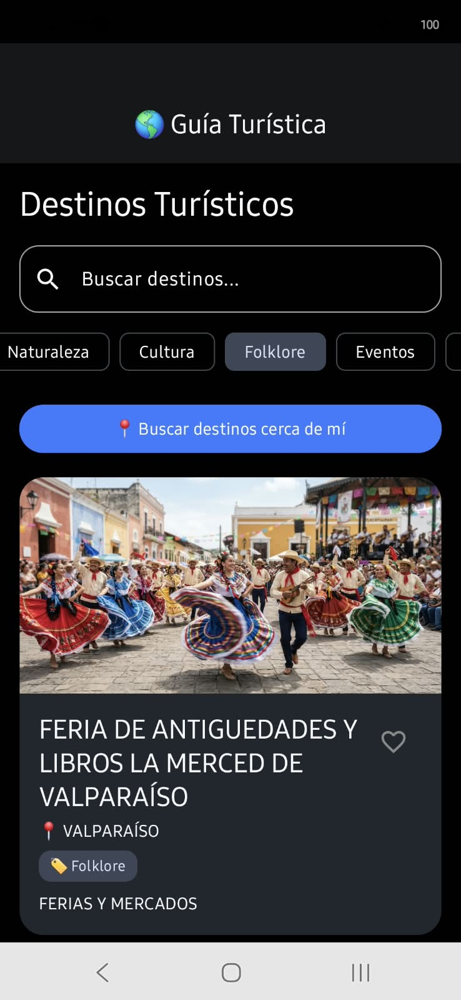

## Filtro 7

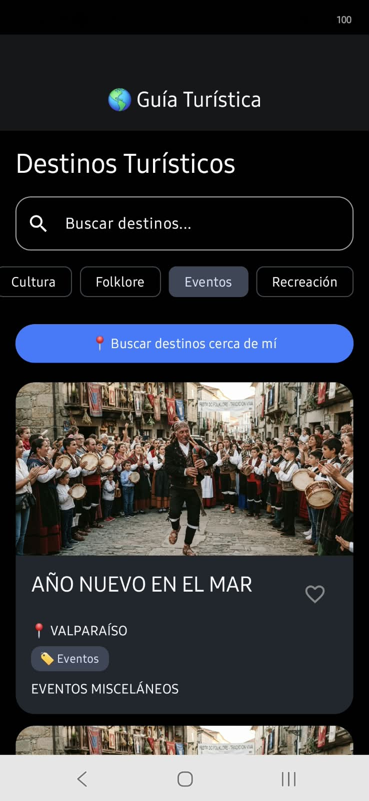

---

# Icono de la aplicación


---

# Requisitos para ejecutar el proyecto

Para ejecutar AppTurismo se requiere:

* Android Studio.
* Android SDK.
* JDK compatible con el proyecto.
* Dispositivo Android físico o emulador.
* Conexión a Internet para las funcionalidades que utilizan servicios externos.
* Permisos de ubicación habilitados para utilizar las funciones relacionadas con GPS.

---

# Instalación y ejecución

1. Clonar el repositorio desde Git.
2. Abrir el proyecto en Android Studio.
3. Esperar la sincronización de Gradle.
4. Conectar un dispositivo Android o iniciar un emulador.
5. Verificar los permisos solicitados por la aplicación.
6. Ejecutar la aplicación desde Android Studio.

---

# APK y AAB

El proyecto permite generar los archivos necesarios para la instalación y distribución de la aplicación.

## APK

El archivo APK permite instalar directamente la aplicación en un dispositivo Android para realizar pruebas.

## AAB

El archivo AAB (Android App Bundle) corresponde al formato utilizado para la distribución de aplicaciones Android.

Se generó un AAB firmado como parte del proceso de despliegue del proyecto.

---

# Git y control de versiones

El proyecto utiliza **Git** para el control de versiones y **GitHub** como repositorio remoto.

Durante el desarrollo se realizaron diferentes commits para registrar los avances y modificaciones realizadas en la aplicación.

---

# Proyecto académico

| Característica         | Información                   |
| ---------------------- | ----------------------------- |
| **Nombre**             | AppTurismo                    |
| **Tipo**               | Aplicación móvil Android      |
| **Asignatura**         | Aplicaciones Móviles          |
| **Lenguaje principal** | Kotlin                        |
| **Interfaz**           | Jetpack Compose               |
| **Arquitectura**       | MVVM + Repository             |
| **Base de datos**      | Room                          |
| **Preferencias**       | DataStore                     |
| **Comunicación REST**  | Retrofit + OkHttp             |
| **Imágenes**           | Coil                          |
| **Ubicación**          | Google Play Services Location |

---

# Autor

Proyecto académico desarrollado para la asignatura de **Aplicaciones Móviles**.
